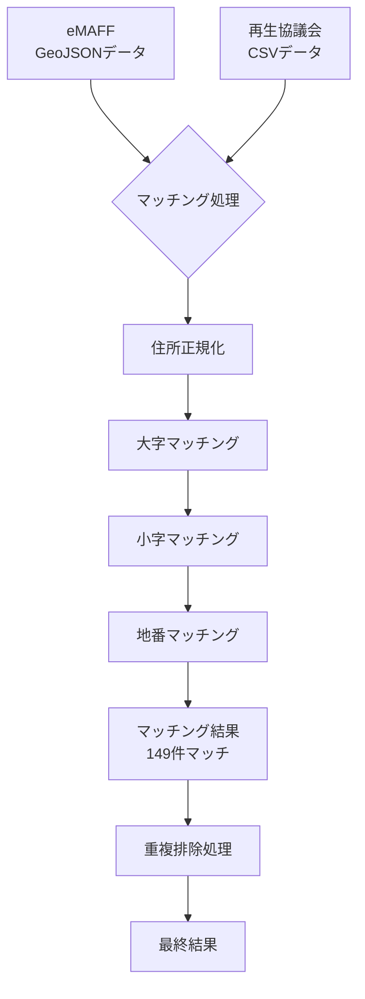

# データマッチングロジック詳細

## 概要

eMAFF から取得した GeoJSON データと、再生協議会から取得した CSV データを照合し、農地の耕作者情報を統合する処理について説明します。

## マッチング処理フロー



## データ構造の違い

### GeoJSON データの住所形式

```
福岡県みやま市瀬高町河内1567-2
```

- 字（あざ）の情報が含まれていない
- 地番は「1567-2」の形式

### CSV データの住所形式

```
福岡県みやま市瀬高町河内字古賀1567-2
```

- 字（あざ）の情報「古賀」が含まれる
- 地番は同じ「1567-2」の形式

## 住所パース処理

### 1. GeoJSON 住所のパース

```typescript
// 入力: "福岡県みやま市瀬高町河内1567-2"
const parseGeoJSONAddress = (address: string) => {
  // 正規表現で大字と地番を抽出
  const match = address.match(/([^\d]+)(\d+(?:-\d+)*)/);
  return {
    oaza: "河内", // 大字
    chiban: "1567", // 地番本番
    edaban: "2", // 枝番
  };
};
```

### 2. CSV 住所のパース

```typescript
// 入力: "福岡県みやま市瀬高町河内字古賀1567-2"
const parseCSVAddress = (address: string) => {
  // "字"で分割して小字を抽出
  const parts = address.split("字");
  return {
    oaza: "河内", // 大字
    koaza: "古賀", // 小字
    chiban: "1567", // 地番本番
    edaban: "2", // 枝番
  };
};
```

## マッチング条件

### ステップ 1: 大字マッチング

```typescript
if (geoJSON.oaza !== csv.oaza) {
  return false; // マッチング失敗
}
```

### ステップ 2: 小字マッチング（存在する場合）

```typescript
if (csv.koaza && geoJSON.koaza) {
  if (geoJSON.koaza !== csv.koaza) {
    return false; // マッチング失敗
  }
}
// 小字が片方にしかない場合はスキップ
```

### ステップ 3: 地番マッチング

```typescript
// 地番の完全一致を確認
const geoTiban = `${geoJSON.chiban}${
  geoJSON.edaban ? "-" + geoJSON.edaban : ""
}`;
const csvTiban = `${csv.chiban}${csv.edaban ? "-" + csv.edaban : ""}`;

if (geoTiban === csvTiban) {
  return true; // マッチング成功
}
```

## 重複防止メカニズム

### 問題

- 1 つの CSV レコードが複数の GeoJSON 要素にマッチしてしまう可能性
- マッチング率が 100%を超える問題

### 解決策

```typescript
const usedCSVRecords = new Set<string>();

for (const feature of geoJSONFeatures) {
  const matchedCSV = matchFarmlandWithCSV(feature, csvData);
  if (matchedCSV) {
    const csvKey = createCSVKey(matchedCSV);

    // まだ使用されていないCSVレコードの場合のみマッチング
    if (!usedCSVRecords.has(csvKey)) {
      matchingResults.set(feature.properties.DaichoId, matchedCSV);
      usedCSVRecords.add(csvKey);
    }
  }
}
```

### CSV キー生成

```typescript
function createCSVKey(csv: OwnedFarmlandCSV): string {
  return `${csv.organizationName}-${csv.oaza}-${csv.koaza}-${csv.chiban}-${
    csv.edaban || ""
  }`;
}
```

## マッチング結果の統計

### 現在の実績

- **総 GeoJSON レコード**: 8,913 件
- **総 CSV レコード**: 201 件
- **マッチング成功**: 199 件
- **マッチング率**: 99%

高精度なマッチングを実現し、ほぼ全ての CSV データが GeoJSON データと正常に照合されています。
