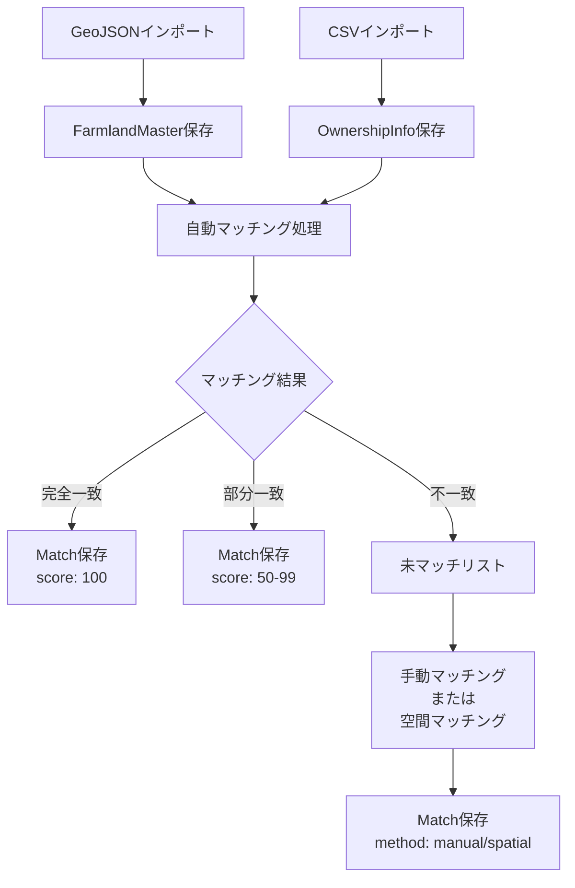

# データアーキテクチャ設計書

## 🎯 要件整理

### データソースの特性
1. **GeoJSONデータ**
   - 農地の地理情報（座標、ポリゴン）
   - 基本属性（地番、住所、面積、農地区分）
   - 耕作者ハッシュ（個人情報保護）
   - 更新頻度：年1-2回

2. **耕作者CSVデータ**
   - 集落営農法人の所有農地リスト
   - 地番情報（大字・小字・地番）
   - 耕作者名は削除済み（プライバシー保護）
   - 更新頻度：随時

3. **将来的な拡張**
   - 異なるソースからのデータ追加
   - ポリゴンデータの空間結合
   - 作物情報、収穫データの追加

## 📊 推奨データ構造

### オプション1: 分離型アーキテクチャ（推奨）

```typescript
// 1. 農地マスタテーブル（GeoJSONベース）
interface FarmlandMaster {
  id: string;                      // 一意識別子（DaichoId）
  geometry: GeoJSON.Geometry;      // 地理情報
  coordinates: [number, number];   // ピン座標
  
  // 基本属性
  address: string;
  tiban: string;
  area: number;
  landType: string;
  
  // 外部キー
  farmerHashId?: string;           // 耕作者ハッシュ
  
  // メタデータ
  sourceType: 'geojson';
  importedAt: Date;
  lastUpdated: Date;
}

// 2. 所有権情報テーブル（CSVベース）
interface OwnershipInfo {
  id: string;                      // 一意識別子
  
  // 地番情報
  oaza: string;
  koaza: string;
  chiban: string;
  fullAddress: string;
  
  // 所有者情報
  ownerType: 'collective' | 'individual' | 'unknown';
  ownerGroupId?: string;           // 集落営農法人ID
  
  // メタデータ
  sourceType: 'csv';
  importedAt: Date;
}

// 3. マッチングテーブル（中間テーブル）
interface FarmlandOwnershipMatch {
  id: string;
  farmlandId: string;              // FarmlandMaster.id
  ownershipId: string;             // OwnershipInfo.id
  
  // マッチング情報
  matchingMethod: 'exact' | 'partial' | 'manual' | 'spatial';
  matchingScore: number;           // 0-100の信頼度スコア
  matchingDetails: {
    tibanMatch: boolean;
    addressMatch: boolean;
    spatialMatch: boolean;
  };
  
  // 検証状態
  verificationStatus: 'pending' | 'verified' | 'rejected';
  verifiedBy?: string;
  verifiedAt?: Date;
  
  // メタデータ
  createdAt: Date;
  updatedAt: Date;
}

// 4. 耕作者マスタ（将来拡張用）
interface FarmerMaster {
  id: string;
  hashId: string;                  // GeoJSONのFarmerIndicationNumberHash
  displayName?: string;             // 表示名（匿名化済み）
  farmerType: 'individual' | 'collective' | 'corporation';
  color: string;                    // 地図表示色
  
  // 統計情報（集計値）
  stats?: {
    totalArea: number;
    farmlandCount: number;
    mainCrops?: string[];
  };
}
```

### オプション2: 統合型アーキテクチャ（シンプル）

```typescript
// 単一の統合テーブル
interface IntegratedFarmland {
  id: string;
  
  // GeoJSONデータ
  geometry?: GeoJSON.Geometry;
  coordinates?: [number, number];
  geoJsonData?: any;
  
  // CSVデータ
  ownershipData?: any;
  isCollectiveOwned: boolean;
  
  // マッチング状態
  dataSource: 'geojson' | 'csv' | 'matched';
  matchingStatus?: 'complete' | 'partial' | 'unmatched';
}
```

## 🔍 推奨理由（分離型を推奨）

### メリット
1. **データの独立性**
   - 各データソースを独立して更新可能
   - データ品質の個別管理
   - ソースごとの履歴管理

2. **柔軟なマッチング**
   - 複数のマッチング手法を試行可能
   - マッチング結果の検証・修正が容易
   - 信頼度スコアによる品質管理

3. **拡張性**
   - 新しいデータソースの追加が容易
   - 1対多、多対多の関係に対応
   - 段階的な機能追加が可能

4. **トレーサビリティ**
   - データの出所が明確
   - 更新履歴の追跡
   - 監査対応

### デメリット
- 初期実装がやや複雑
- JOINクエリが必要
- データ整合性の管理が必要

## 🔄 マッチング処理フロー



## 💾 実装例

### データ取得クエリ
```typescript
// 農地情報と所有権情報を結合して取得
async function getFarmlandsWithOwnership() {
  const query = `
    SELECT 
      f.*,
      o.*,
      m.matchingScore,
      m.verificationStatus
    FROM FarmlandMaster f
    LEFT JOIN FarmlandOwnershipMatch m ON f.id = m.farmlandId
    LEFT JOIN OwnershipInfo o ON m.ownershipId = o.id
    WHERE m.verificationStatus != 'rejected'
    ORDER BY m.matchingScore DESC
  `;
  
  return executeQuery(query);
}

// 集落営農法人の農地のみ取得
async function getCollectiveFarmlands() {
  const query = `
    SELECT f.*, o.*
    FROM FarmlandMaster f
    INNER JOIN FarmlandOwnershipMatch m ON f.id = m.farmlandId
    INNER JOIN OwnershipInfo o ON m.ownershipId = o.id
    WHERE o.ownerType = 'collective'
    AND m.verificationStatus = 'verified'
  `;
  
  return executeQuery(query);
}
```

### フロントエンドでのデータ管理
```typescript
// Zustandまたはコンテキストでの状態管理
interface FarmlandStore {
  // 生データ
  farmlandMaster: FarmlandMaster[];
  ownershipInfo: OwnershipInfo[];
  matches: FarmlandOwnershipMatch[];
  
  // 結合済みビュー
  farmlandsWithOwnership: EnrichedFarmland[];
  
  // フィルタ状態
  showOnlyCollective: boolean;
  showOnlyMatched: boolean;
  
  // アクション
  loadFarmlands: () => Promise<void>;
  loadOwnership: () => Promise<void>;
  performMatching: () => Promise<void>;
  updateMatch: (matchId: string, updates: Partial<FarmlandOwnershipMatch>) => Promise<void>;
}
```

## 🚀 段階的実装計画

### Phase 1: MVP（現在）
- FarmlandMasterのみ使用
- GeoJSONデータの表示
- 簡易的なCSVマッチング（メモリ内）

### Phase 2: データベース化
- 3テーブル構造の実装
- 自動マッチング処理
- マッチング結果の永続化

### Phase 3: 高度なマッチング
- 空間マッチング（ポリゴン結合）
- 信頼度スコアリング
- 手動マッチングUI

### Phase 4: 分析機能
- 所有形態別の統計
- 時系列変化の追跡
- レポート生成

## 📝 データ品質管理

### マッチング品質指標
```typescript
interface QualityMetrics {
  totalRecords: number;
  matchedRecords: number;
  matchRate: number;
  
  scoreDistribution: {
    perfect: number;      // score = 100
    high: number;         // score >= 80
    medium: number;       // score >= 60
    low: number;          // score < 60
  };
  
  verificationStatus: {
    verified: number;
    pending: number;
    rejected: number;
  };
}
```

### データ検証ルール
1. **地番の一意性チェック**
   - 同一地番の重複を検出
   - 枝番の整合性確認

2. **空間的整合性**
   - 座標の妥当性確認
   - 隣接関係の検証

3. **時系列整合性**
   - 更新日時の妥当性
   - 変更履歴の追跡

## 🔒 セキュリティ考慮事項

1. **個人情報の保護**
   - 耕作者名の非表示
   - ハッシュ値での管理
   - アクセス権限の制御

2. **データの完全性**
   - 更新ログの記録
   - バックアップ戦略
   - ロールバック機能

3. **監査対応**
   - 全操作のログ記録
   - データ変更の追跡
   - レポート生成機能